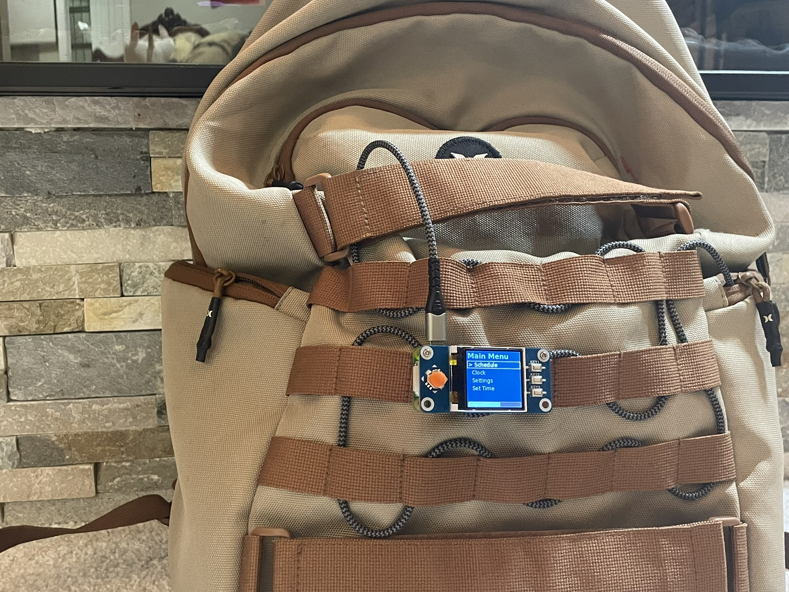
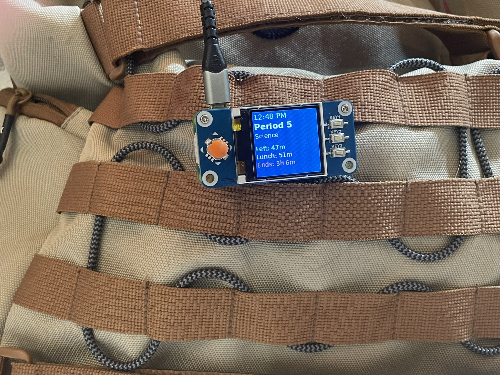

# Timagotchi
## MESSAGE TO BLUEPRINT - My project has no real wiring because i decided to use a power bank and a premade HAT. one of you asked for that, so im just keeping this here for now.


A school schedule display system for Raspberry Pi Zero WH with Waveshare 1.44" LCD HAT.
## LOTS OF CODE IS AI, README IS NOT AI
## Overview
This project is a pi zero scheduler that tells u info about ur schedule w/ lots of features.
This is my science fair project, MESA Project, and Hackclub blueprint project. I am currently getting others to prototype it with their respective schedules.
## Features

### Configuration
- **AI-Powered Setup (NEW)**: Upload a photo of your schedule and let AI extract all the details automatically
- **Manual Configuration**: Traditional web-based form for manual entry
- **Web Portal**: Cloud-hosted configuration interface with 5-digit pairing codes

### Display & Navigation
- **Main Page**: lil guy i stole from Pwnagotchi
- **Schedule View**: Shows current pd, based off ur schedule
- **Progress Bar**: Multiple modes (time in class, time in day, lunch countdown) - configurable in settings
- **Clock View**: It's a clock.
- **Theme System**: Funny colors
- **Sidebar**: shows what page ur on and stuff, idk looks cool
- **WiFi Status Indicator**: Lil box that tells u if u have wifi or no. kinda broken lol

### Schedule Management
- **A/B Day Support**: Automatic or manual A/B day scheduling with preset rotation
- **Advisory Period**: Optional morning advisory (homeroom) period support
- **Passing Time Detection**: Shows "passing" between periods
- **Custom Phrases**: JSON-configurable phrases that appear based on current period

### Canvas Integration
- **Grades Display**: View current grades from Canvas LMS
- **Assignment List**: Browse assignments by course
- **Course Details**: See course names and current percentages
- **API Configuration**: Secure canvas_config.json for base URL and API token

### Settings & Customization
- **Theme Selector**: Choose from multiple pre-configured themes
- **Progress Bar Modes**: Switch between different progress visualization styles
- **Time Settings**: Manual time adjustment via on-screen controls
- **A/B Day Override**: Manually set which day type (A or B) when in manual mode
- **Stopwatch**: Built-in stopwatch with start/stop/reset
- **Developer Mode**: Konami code. iykyk

## Target Hardware

- **Board**: Raspberry Pi Zero WH
- **Display**: Waveshare 1.44" LCD HAT
- **Operating System**: Raspberry Pi OS (tested on Bookworm & trixie)
- **Battery**: Battery or battery bank w/ cable

## Project Structure

### Core Files
- `main.py` – Starts everything and manages the main loop
- `display_waveshare.py` – Display driver with theme support and rendering functions
- `input_handler.py` – GPIO button input handling with debouncing
- `menu.py` – Menu system, navigation, Canvas integration, and game launchers
- `theme_manager.py` – Theme loading and color management
- `tetris.py` – Original Pygame Tetris (legacy)
- `tetris_waveshare.py` – Tetris implementation for the 128x128 LCD
- `doom_raycaster.py` – Built-in Doom-style FPS raycaster engine
- `doom_wrapper.py` – PyDoom detection and launcher fallback
- `custom_script_example.py` – Template for creating custom scripts
 
### Configuration & Utilities
- `config.py` – Schedule definition (editable manually or via the helper script)
- `configure_schedule.py` – Interactive schedule configuration tool
- `themes.json` – Theme color definitions
- `Phrases.json` – Context-aware phrases by period
- `canvas_config.json` – Canvas LMS API credentials (created during setup)
- `schedule-display.service` – systemd unit for auto-start/restart
- `install.sh` / `start.sh` – Automated installation and launch scripts
- `old code/` – Legacy drivers and code, kept for compatibility

## Dependencies

### Python Packages
- `pillow>=10.0.0` – Image rendering, fonts, and graphics
- `numpy>=1.24.0` – Numerical operations for rendering
- `spidev>=3.6` – SPI communication with the display
- `RPi.GPIO` or `lgpio>=0.2.2.0` – GPIO access (automatic fallback on Bookworm)
- `requests` – Canvas API integration
- `pygame` – Legacy game support (optional)
- `mss` – Screen capture for advanced features (optional)
- `Cython` – For building extensions (optional)

### System Requirements
- Root access for GPIO and service management
- Internet connection for Canvas integration and setup
- SPI interface enabled (`sudo raspi-config`)
- Basic Linux/Python knowledge for customization

## Installation

Install PiOS 32bit

### Automated Installation

```bash
sudo raspi-config
```

Navigate to: **Interfacing Options → SPI → Yes**, then reboot. this is for the screen to work

```bash
git clone https://github.com/broseph9972/Timagotchi && cd Timagotchi/Code
```

```bash
chmod +x install.sh start.sh
./install.sh
```

Reboot with ```sudo reboot``` 

To customize your schedule run 
```bash
python3 Timagotchi/Code/configure_schedule.py
```
**If install.sh and start.sh wont run, try ```dos2unix install.sh start.sh``` this happens when i sftp it over. If using git ignore this**

**Important**: Reboot after install.

it should start on default but if not use

### Manual Installation

#### 1. Enable SPI Interface

```bash
sudo raspi-config
```

Navigate to: **Interfacing Options → SPI → Yes**, then reboot. this is for the screen to work

#### 2. Install Dependencies

```bash
sudo apt-get update
sudo apt-get install python3-pip python3-pil python3-numpy
pip3 install -r requirements.txt
```

#### 3. Do gpio stuff

```bash
sudo usermod -aG gpio [Your username]
```


#### 4. Configure Your Schedule & Canvas (Optional)

Run the interactive configuration script:

```bash
python3 configure_schedule.py
```

For Canvas integration, you'll be prompted during `install.sh` or you can manually create `Code/canvas_config.json`:

```json
{
  "base_url": "https://yourschool.instructure.com",
  "api_token": "your_canvas_api_token_here"
}
```

To get a Canvas API token:
1. Log into Canvas
2. Account → Settings → New Access Token
3. Copy token to canvas_config.json

## Advanced Features

### Custom Scripts

Create `Code/custom_script.py` with a `run(display, input_handler)` function:

```python
def run(display, input_handler):
    """
    Your custom code here.
    Return 'key1', 'key2', or 'key3' to navigate on exit.
    """
    display.clear((0, 0, 0))
    display.draw.text((10, 50), "Hello World!", 
                      font=display.font_large, 
                      fill=(255, 255, 255))
    display._render()
    
    while True:
        action = input_handler.get_input()
        if action in ('key1', 'key2', 'key3'):
            return action
```

Access via Secret Menu → Run Custom Script.

### Creating Custom Themes

Edit `Code/themes.json` to add new themes:

```json
{
  "theme_name": {
    "background": [20, 20, 30],
    "text_primary": [255, 255, 255],
    "text_secondary": [150, 150, 150],
    "accent": [100, 200, 255],
    "sidebar_box": [40, 40, 50],
    "sidebar_box_selected": [60, 60, 80],
    "divider": [80, 80, 100]
  }
}
```

### Adding Custom Phrases

Edit `Code/Phrases.json` to customize what your character says:

```json
{
  "passing": ["Almost there!", "Quick break!"],
  "lunch": ["Time to eat!", "Lunch break!"],
  "period1": ["Good morning!", "Let's start!"]
}
```

## Usage

### Web Configuration (Recommended)

The easiest way to configure your Timagotchi is through the web portal:

#### Method 1: AI-Powered Configuration (NEW)

1. Visit the web portal (see `web/README.md` for deployment)
2. Click "Use AI Configurator"
3. Upload a photo of your school schedule
4. AI analyzes and extracts all schedule details
5. Answer any clarification questions
6. Configure Canvas LMS and WiFi if needed
7. Enter your device's 5-digit pairing code
8. Submit and your device will sync automatically

**Requirements:**
- Free Gemini AI API key (see `web/AI_CONFIG_README.md`)
- Clear photo of your schedule
- Internet connection

**Supported Schedule Types:**
- Traditional 7-period schedules
- A/B block schedules
- 4x4 semester blocks
- Rotating schedules
- Elementary with specials
- College MWF/TR patterns

#### Method 2: Manual Web Configuration

1. Visit the web portal
2. Click "Manual Configuration"
3. Fill out the detailed form with your schedule
4. Configure Canvas and WiFi
5. Enter device pairing code
6. Submit

See `web/README.md` for full web portal documentation.

### Run Manually

```bash
sudo python3 main.py
```

### Controls

#### D-Pad Navigation
- **Up/Down**: Navigate menu items, move in games
- **Left/Right**: Navigate menu items, turn in games, adjust settings
- **Center Press**: Select item (hard to press - use Right as alternative)

#### Function Keys
- **Key1** (top right): Navigate to Main Page from anywhere
- **Key2** (middle right): Navigate to Grades from anywhere
- **Key3** (bottom right): Navigate to Settings from anywhere

#### Game Controls
**Tetris:**
- Up: Rotate piece
- Left/Right: Move piece
- Down: Drop faster
- Center: Hard drop
- Key1/2/3: Exit to menu

**Shitty Doom:**
- Up/Down: Move forward/backward
- Left/Right: Turn
- Center: Shoot
- Key1/2/3: Exit to menu

_All joystick directions and buttons are active-low with pull-ups enabled._

### Menu Navigation

#### Main Navigation (Right Sidebar)
1. **Main Page** (Key1): Animated character with schedule info
2. **Grades** (Key2): Canvas grades and assignments
3. **Settings** (Key3): Themes, time, A/B day, stopwatch, etc.

#### Settings Submenu
- **A/B Day**: Toggle between auto/manual A/B day scheduling
- **Theme**: Choose from multiple color themes
- **Progress Bar**: Change progress bar visualization mode
- **Set Time**: Manually adjust system time
- **Stopwatch**: Built-in timer
- **Developer**: Enter Konami code here for secret menu
- **Update**: Check for updates (if configured)
- **Restart**: Restart the application

#### do konami on dev page.

## GPIO Pin Mapping (Waveshare 1.44" LCD HAT)

### Display (ST7735S)
- SPI Port: 0
- CS: GPIO 8 (CE0)
- DC: GPIO 25
- RST: GPIO 27
- Backlight: GPIO 24

### Joystick & Buttons
- Up: GPIO 6
- Down: GPIO 19
- Left: GPIO 5
- Right: GPIO 26
- Press: GPIO 13
- Key1: GPIO 21
- Key2: GPIO 20
- Key3: GPIO 16

## TODO
- Weather display
- ~~Multiple schedule profiles~~ (implemented as A/B day presets)
- ~~Timer/stopwatch mode~~ (implemented)
- ~~Check grades via Canvas~~ (implemented)
- ~~Progress bar~~ (implemented with multiple modes)
- Alarm/notification system
- Battery level indicator (if using portable power)
- Sound effects via PWM buzzer
- Network time sync improvements
- Easily imagable file for easy install
- Prototype for others to use
- (Only if it actually works) Ai scans your schedule and gives u a config
### auto start w/ systemd service

Copy the included service file and enable it:

```bash
sudo cp schedule-display.service /etc/systemd/system/
sudo systemctl daemon-reload
sudo systemctl enable schedule-display.service
sudo systemctl start schedule-display.service
```

Check status:
```bash
sudo systemctl status schedule-display.service
```

View logs:
```bash
sudo journalctl -u schedule-display.service -f
```

**Note**: Edit the service file if your project is not in `/home/pi/schedule-display`.

### Option 2: rc.local

Add to `/etc/rc.local` (before `exit 0`):

```bash
cd /home/pi/schedule-display && sudo python3 main.py &
```

#_I Hope this project helps you be slightly productive and if you have any suggestions at all feel free to contribute or create an issue in the repo. Idk what starring does but if you like this project please do that. THANK YOU!_#
